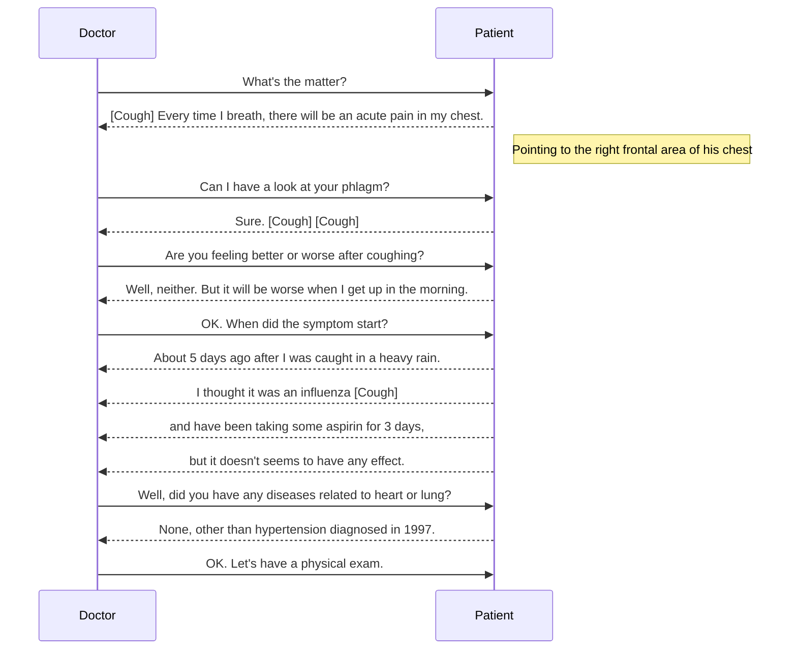

<!--
教师：张洁
邮箱：mail:gailzhang@sina.com
-->

医学英语
========
## 大病历
### 问诊



### 病例报告

```
Name                        XXX
Gender                      Male
Age                         53 y/o
Chief complaints            5 days of acute chest pain when breathing
History of Present Illness  The patient complains about 5 days of acute pain in the right frontal
                            area of chest when breathing. Symptoms get worse in the morning.
                            Aspirin is taken 2 days after chest pain for 3 days, while no relief.
                            Rusty expectoration is observed. Besides, A positive Pleural friction
                            sign is observed during physical examination.
Past Medical History        HPT for 21 years
Allergy                     None
```
