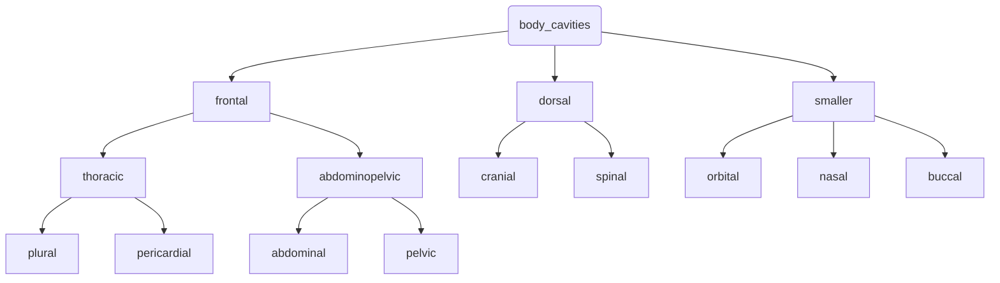

```mermaid
graph TD;
    bc(body_cavities)

    bc --> frontal
    bc --> dorsal
    bc --> smaller
    frontal --> thoracic
    frontal --> abdominopelvic
    abdominopelvic --> abdominal
    abdominopelvic --> pelvic

    thoracic --> plural
    thoracic --> pericardial

    dorsal --> cranial
    dorsal --> spinal

    smaller --> orbital
    smaller --> nasal
    smaller --> buccal
```
