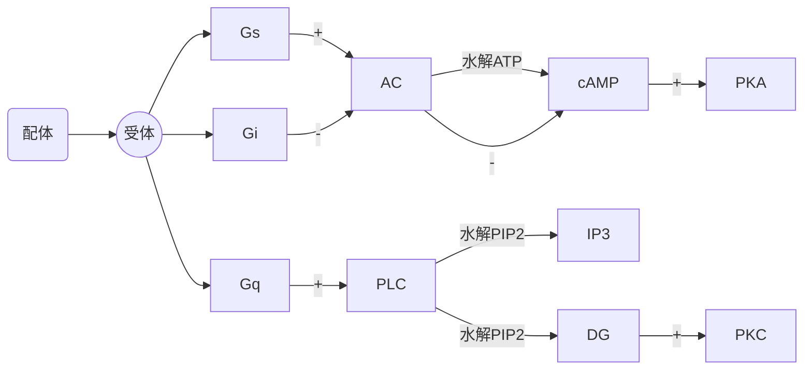
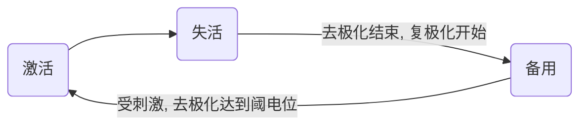

# 绪论
## 内环境与稳态

### 内环境
- 体液
    + 细胞内液 (2/3)
    + 细胞外液 (1/3) (内环境)
        * 组织液 (3/4)
        * 血浆 (1/4)

### 稳态
稳态定义: 内环境各种理化性质保持相对稳定的状态

维持方式: 反馈调节 (主要为负反馈调节)

## 机体生理功能的调节
- 神经调节
    + 方式: 反射
    + 特点: 迅速、准确、短暂、局限
- 体液调节
    + 方式: 内分泌
    + 特点: 缓慢、广泛、持久
    + 形式
        * 内分泌 (全身体液调节)
        * 局部体液调节
        * 神经分泌
- 自身调节
    + 定义: 某些细胞、组织器官不依赖于外来神经、体液等作用产生的适应性反应

反射定义: 机体在中枢神经控制下对内、外环境作出的规律性应答.

## 体内控制系统
- 非自动控制系统 (开环系统)
- 反馈控制系统 (闭环系统)
    + 负反馈控制系统
        * 作用: 最重要的反馈调节机制、维持稳态
    + 正反馈控制系统
        * 作用: 加速生理过程、破坏稳态
        * 主要控制
            - 血液凝固
            - 排尿
            - 分娩
    + 前馈系统

# 细胞的基本功能

## 细胞膜的结构和物质转运功能

### 物质的转运方式
- 单纯扩散
    + 对象: 脂溶性小分子
    + 影响因素: 分子大小、带电量
- 膜蛋白介导的跨膜转运
    + 易化扩散
        * 经载体
            - 对象: 葡萄糖、氨基酸、核苷酸
            - 特点: 饱和现象、结构特异性、竞争性抑制
        * 经通道
            - 对象: 带电离子
            - 特点: 离子选择性、门控特性
    + 主动转运
        * 原发性 (离子泵/ATPase)
        * 继发性
            + 同向转运
            + 逆向转运
- 入胞/出胞

#### Na-K ATPase
- 特点
    + 激活条件: 胞内$Na^+$升高/胞外$K^+$升高
    + 1分子ATP = 3$Na^+$出 & 2$K^+$入
    + 生电性泵
- 生理意义
    + 造成膜内外$Na^+$浓度差, 形成势能储备
    + 造成细胞内$K^+$浓度高, 维持体内代谢反应
    + 进出离子数不相等, 维持细胞正常形态和渗透压
    + 是生物电活动产生前提

## 细胞的跨膜信号转导
受体: 靶细胞中能与配体专一结合的分子, 其本质是蛋白质

### G蛋白耦联受体介导的信号转导
1. 第一信使定义: 胞外化学物质 (激素、神经递质、细胞因子)

2. 第二信使定义: 第一信使作用于细胞膜后产生的细胞内信号分子.
 (cAMP, cGMP, IP3, DG, $Ca^{2+}$)

3. AC途径



### 酶耦联受体介导的信号转导
1. 分类:酪氨酸激酶受体、鸟苷酸环酶受体

## 细胞的生物电现象

### 静息电位
1. 静息电位定义: 细胞在未受刺激时存在于细胞膜两侧的电位差

2. 产生机制: 主要是$K^+$外流
    - $K^+$外流动力: 细胞内高$K^+$浓度
    - $K^+$外流条件: 细胞膜对$K^+$具有通透性

3. $K^+$的平衡电位(能斯特方程)

4. 影响因素:
    - 细胞外$K^+$离子浓度
    - 细胞膜对$K^+$, $Na^+$通透性
    - Na-K泵活动水平

5. 特异性$K^+$通道阻断剂: 四乙胺

### 动作电位
1. 动作电位定义: 可兴奋细胞受到阈上刺激, 刺激处细胞膜两侧出现的快速可逆的电位变化

2. 产生机制: 主要是$Na^+$外流

3. 动作电位特点:
    - 全或无
    - 可传播性

4. AP膜电位变化: 极化、去极化、复极化、超极化
    - 锋电位
        + 升支: $Na^+$通透性突然增加, 形成$Na^+$内向电流, 达到超射顶点关闭
            * $Na^+$外流动力: 细胞外高$Na^+$浓度
            * $Na^+$外流条件: 细胞膜$Na^+$通道大量开放
        + 降支: $K^+$通透性增加, 形成$K^+$外向电流
            * $K^+$外流动力: 细胞内高$K^+$浓度
            * $K^+$外流条件: 细胞膜对$K^+$具有通透性
    - 后电位
        + 负后电位
            * 复极时$K^+$蓄积在膜外侧附近, 暂时阻碍$K^+$外流 + 正后电位
            * 生电性Na-K泵作用导致超极化

5. 阈值: 引起细胞产生AP所需最小刺激强度
    - 阈上刺激
    - 阈下刺激

6. 阈电位: 由阈刺激引起的膜内电位去极化达到引发AP产生的临界值

7. 特异性$Na^+$通道阻断剂: 河豚毒素

8. 产生机制
	+ 电化学驱动力
   	    - 内向电流: 正电荷从膜外进入膜内
        - 外向电流: 正电荷从膜内进入膜外

9. $Na^+$电流再生性循环(正反馈):


$Na^+$通道形态:



### 局部电位
1. 定义: 阈下刺激使膜产生紧张电位, 使受刺激的局部产生较小的膜去极化反应.

2. 特点:

|  特点  |     局部电位     |     动作电位     |
|:------:|:----------------:|:----------------:|
|刺激强度|     阈下刺激     |     阈上刺激     |
| Na通道 |    配体门控型    |    电压门控型    |
|电位产生|      全或无      |     非全或无     |
| 不应期 |        无        |        有        |
|  总和  |        有        |        无        |
|传播方式|电紧张扩布 (衰减) |局部电流 (不衰减) |

|   \    |神经纤维(AP)|神经-骨骼肌接头(局部电位)|
|:------:|:----------:|:-----------------------:|
| 方向性 |    双向    |          单向           |
|  速度  |     快     |           慢            |
|局部电位|     无     |        终板电位         |
|  疲劳  |    不易    | 易疲劳,易受环境药物影响 |
|  传递  |    1:n     |           1:1           |

### AP的产生

|   周期   |    电位    | 兴奋性 |
|:--------:|:----------:|:------:|
|绝对不应期| 锋电位降支 |   无   |
|相对不应期|负后电位前部|逐渐恢复|
|  超常期  |负后电位后部|  略高  |
|  低常期  |  正后电位  |  略低  |


### AP的传导
1. 方式: 局部电流


## 肌细胞的收缩

### N-M接头处兴奋传递
1. 结构: 运动神经末梢 + 骨骼肌细胞
2. 传递: AP --> 神经末梢 --> $Ca^{2+}$通道开放 --> 突触小泡中ACh量子释放
    --> ACh与终板膜上配体门控型$Na^+$通道特异性结合 --> 终板膜去极化
    --> 形成终板电位 --> 电紧张扩布 --> 临近肌细胞膜产生AP
    --> ACh酶分解ACh

### 横纹肌细胞收缩
1. 肌管系统
    - 横管(T管)
    - 纵管 (肌质网/L管)
    - 三联管 (横管+终池(纵管膨大))
1. 肌丝滑行学说
    - 组成
        + 粗肌丝
            * 肌球蛋白 (含横桥)
        + 细肌丝
            * 肌动蛋白
            * 原肌凝蛋白
            * 肌钙蛋白 (含亚单位C、I、T)
    - 功能
        + **横桥**
            * 有肌动蛋白结合位点
            * 头部有ATP酶活性
        + 原肌球蛋白: 位阻效应
    - 肌肉收缩过程: 肌细胞兴奋 --> 三联管处兴奋 --> 收缩耦联
        --> 终池释放Ca+ --> Ca+与肌钙蛋白结合 --> 原肌凝蛋白变构
        --> 肌动蛋白结合位点暴露 --> 肌球蛋白结合肌动蛋白
        --> 肌球蛋白分解ATP, 变构, 肌丝滑动 --> 肌节缩短

### 横纹肌兴奋-收缩耦联
1. 收缩过程: 肌细胞膜AP --> 横管 --> 三联管 --> L型钙通道
    --> 终池$Ca^{2+}$释放 --> 胞质$Ca^{2+}$浓度上升 --> $Ca^{2+}$与肌钙蛋白结合
2. 舒张过程: 肌质网Ca泵作用 --> 胞质$Ca^{2+}$浓度下降 --> 肌肉舒张

### 影响横纹肌收缩效能的因素
1. 负荷
    - 前负荷: 粗细肌丝重叠面积.
    - 后负荷
2. 肌收缩能力: 主要取决于$Ca^{2+}$水平与横桥ATP酶活性
3. 收缩的总和
    - 数量的总和: 参与收缩的运动单位
    - 频率的总和
        + 单收缩
        + 不完全强直收缩
        + 完全强直收缩


# 血液
1. 组成
    - 血浆 (55%)
        + 无机物
        + 血浆蛋白
    - 血细胞 (45%)
        + 红细胞
        + 白细胞
        + 血小板

## 血液的组成和理化性质
1. 血浆
    - 无机物 (水, $Na^+$等)
    - 血浆蛋白
        + 白蛋白
        + 球蛋白
        + 纤维蛋白原
2. 血细胞
    - 红细胞 (99%)
    - 白细胞
    - 血小板
3. 血液的比重: 全血>血浆
4. 血液的粘度: 血液>血浆>水
5. **血浆渗透压组成**
    - 晶体渗透压 (770kPA) : 主要有$Na^+$, $Cl^-$
    - 胶体渗透压 (3.3kPA) : 主要有白蛋白
6. *等渗溶液与等张溶液*
    - 等张溶液
    - 等渗溶液

## 血细胞生理

### 红细胞
1. 数量
    - 成年男性: $(4.0-5.5) \times 10^{12}/L$
    - 成年女性: $(3.5-5.0) \times 10^{12}/L$
2. **血细胞比容**
    - 成年男性: 40% - 50%
    - 成年女性: 37% - 48%
    - 新生儿: 55%
3. 血量: 体重7% - 8%
4. 组成: 血红蛋白 (Hb)
5. 生理特征
    - 可塑变形性: 红细胞在外力作用下具有变形的能力.
    - 悬浮稳定性: 红细胞能够比较稳定的悬浮于血浆中不易下沉的能力.
    - 渗透脆性: 红细胞在低渗盐溶液中发生膨胀破裂的特性.
6. **血沉 (红细胞沉降率, ESR)**
    - 定义: 经抗凝处理的红细胞在第1h末下沉的距离.
    - 正常值: 成年男性0 - 15mm; 女性0 - 20mm
    - 意义: 反映红细胞的悬浮稳定性.
7. 红细胞生成调节
    - **缺铁性贫血(低色素小细胞型贫血)**(Hb合成减少)  : 缺铁
    - **大细胞性贫血**(幼红细胞成熟减慢): 缺叶酸、V-B12
    - 肾病病人贫血: 缺乏促红细胞生成素 (EPO)
8. 红细胞的破坏: 平均寿命=120d
9. 促进红细胞生成的物质 <!--TODO: Add-->

### 白细胞
- 粒细胞
    + 中性粒细胞
    + 嗜酸性粒细胞
    + 嗜碱性粒细胞
- 单核细胞
- 淋巴细胞
    + T淋巴细胞
    + B淋巴细胞

### 血小板
1. 数量: $(100 \sim 300) \times 10^9 /L$
2. 功能: 维持血管壁完整性, 参与凝血.
2. 生理特性
    - 粘附
    - 聚集(两个时相)
    - 释放
    - 收缩
    - 吸附

## 生理性止血
### 生理性止血
1. 基本过程
    - 血管收缩 (减小出血口、有利于血小板粘附)
    - 血小板止血栓形成
    - 纤维蛋白凝块形成

### 血液凝固
1. **血液凝固定义**: 血液由流动的液体状态变成不能流动的凝胶状的过程.
    是血浆中可溶性纤维蛋白原变成不溶性纤维蛋白的过程.
2. 血浆和血清区别
    - 血浆: 凝血前的液体成分, 包含纤维蛋白原与各种凝血因子.
    - 血清: 凝血后的液体成分, 包含血小板释放的少量因子.

3. 凝血因子:
    - 磷脂&IV非蛋白质
    - III存在于组织中, 非血浆中
    - II、VII、IX、X需VK参与
    - 具有酶特性的凝血因子需要激活
    - 底物: I

4. **凝血过程** (三步)
    - 凝血酶原激活物的形成
    - 凝血酶原的激活
    - 纤维蛋白原转化为纤维蛋白

5. 血友病
    - 甲型血友病: VIII因子缺乏
    - 乙型血友病: IX因子缺乏
    - 丙型血友病: XI因子缺乏

6. 内源性凝血与外源性凝血的差别

    |        \         |       内源性凝血       |    外源性凝血     |
    |:----------------:|:----------------------:|:-----------------:|
    |     凝血启动     |胶原/带负电荷异物激活XII|  组织损伤释放III  |
    |凝血酶原激活物形成|      XII-XI-IX-X       |   (III+VIIa)-X    |
    |   凝血因子分布   |       血液内因子       |组织因子+血液内因子|
    |   参与酶的数量   |           多           |        少         |
    |     凝血速度     |           慢           |        快         |

7. 抗凝
    - 纤维蛋白的吸附
    - 单核巨噬细胞吞噬作用
    - 生理性抗凝物质
        + 抗凝血酶
        + 组织因子途径抑制物 (TFPI)
        + 肝素

8. 止血栓溶解
    - 纤溶酶原的激活
    - 纤维蛋白原的降解

9. 凝血的调控

    |   加速   |         延缓         |
    |:--------:|:--------------------:|
    |接触面粗糙|      接触面光滑      |
    | 适当加温 |       适当降温       |
    |  补充VK  |加除钙剂(除凝血因子IV)|
    |          |      加抗凝药物      |

10. 凝血因子:

    |编号|      名称       |
    |:---|:---------------:|
    |I   |  纤维蛋白酶原   |
    |II  |    凝血酶原     |
    |III |   组织凝血酶    |
    |*IV*|    $Ca^{2+}$    |
    |V   |    前加速酶     |
    |VII |    前转变素     |
    |VIII|  抗血友病因子   |
    |IX  |  血浆凝血激酶   |
    |X   |Stuart-Prower因子|
    |XI  |血浆凝血激酶前质 |
    |XII |    接触因子     |
    |XIII|纤维蛋白稳定因子 |

## 血型和输血原则

### 红细胞血型
1. ABO血型

    |血清\红细胞|A |B |AB|O |
    |:---------:|::|::|::|::|
    |     A     |o |x |x |o |
    |     B     |x |o |x |o |
    |    AB     |o |o |o |o |
    |     O     |x |x |x |o |

1. Rh-血型
    - 定义: 红细胞上含有D抗原的称为Rh+, 否则则为Rh-
    - 含Rh抗体, 无Rh抗原. 在第一次接受Rh+血 (第一胎Rh阳性血) 时产生Rh抗体.
    - 临床意义
        + 反复输血
        + 新生儿溶血


1. 交叉配血

```mermaid
graph LR
    subgraph 配血者
        pRBC(红细胞)
        pC(血清)
    subgraph 受血者
        rRBC(红细胞)
        rC(血清)
    pRBC -- 主侧 -- rC
    pC -- 次侧 -- rRBC
```


# 循环系统

## 心脏的生物电活动
1. 心肌细胞分类
    - 按0期去极速度的快慢
        + 慢反应细胞: 窦房结P细胞、房结区和结希区细胞
        + 快反应细胞: 心房肌、心室肌细胞、蒲肯野细胞
    - 按4期自动去极的有无
        + 工作细胞: 心房肌、心室肌细胞
        + 自律细胞: 组成心脏的特殊传导系统
1. 两种离子通道的比较 <!--TODO: Maybe add graph on pp82-83-->

### 心肌细胞的跨膜电位及其形成机制
#### 心室肌细胞 (快反应工作细胞)
- 静息电位
- 动作电位

    快反应细胞动作电位分期变化
    ```
    +------+------+--------------+--------------------+--------------+-------------------+
    |  AP  | 分期 |     名称     |      电位变化      |   形成机制   |       通道        |
    +======+======+==============+====================+==============+===================+
    | 去极 |  0   |  快速去极期  |     -90 ~ 30mV     |  快Na+内流   |     快Na+通道     |
    +------+------+--------------+--------------------+--------------+-------------------+
    |      |  1   | 快速复极初期 |      30 ~ 0mV      |    K+外流    |      IK通道       |
    |      +------+--------------+--------------------+--------------+-------------------+
    |      |      |              |                    |   Ca2+内流   |                   |
    |      |  2   |    平台期    | 0mV左右,持续时间长 +--------------+ I(Ca-L),I(Na)通道 |
    |      |      |              |                    |    K+外流    |                   |
    | 复极 +------+--------------+--------------------+--------------+-------------------+
    |      |  3   | 快速复极末期 |     0 ~ -90mV      | Ca2+内流停止 |    IK,IK1通道     |
    |      +------+--------------+--------------------+--------------+-------------------+
    |      |      |              |                    |   Na+-K+泵   |                   |
    |      |  4   |    静息期    | -90mV,恢复离子分布 +--------------+                   |
    |      |      |              |                    |  Na+-Ca2+泵  |                   |
    +------+------+--------------+--------------------+--------------+-------------------+
    ```
#### 自律细胞
自律细胞AP特点及形成机制

|  跨膜电位  |      窦房结细胞 (慢反应)     |  浦肯野细胞 (快反应) |
|:----------:|:----------------------------:|:--------------------:|
|    分期    |           0、3、4            |        0 ~ 4         |
|最大复极电位|            -70mV             |        -90mV         |
|   阈电位   |            -40mV             |        -70mV         |
|  0 期去极  |    速度慢, 幅度小, 时程长    |速度快, 幅度大, 时程短|
|4 期自动去极|              快              |          慢          |
|4 期形成机制|主要为K+外流, 后程出现Ca2+内流|    主要为Na+内流     |
|0 期形成机制|          慢Ca2+内流          |      快Na+内流       |


### 心肌的电生理特征
#### 兴奋性
1. 影响因素
1. 特点
    - 心肌的有效不应期很长
1. 周期性变化

|   名称   |     时间&电位     |兴奋性|         反应         |  $Na^+$通道  |
|:--------:|:-----------------:|:----:|:--------------------:|:------------:|
|绝对不应期| 0期->复极3期-55mV |  无  |         全无         |   完全失活   |
|局部反应期|复极3期-55mV->-60mV|  无  |  强刺激仅有局部反应  |   少量复活   |
|相对不应期|复极3期-60mV->-80mV|<正常 | 阈上刺激产生低幅度AP |  大部分复活  |
|  超常期  |复极3期-80mV->-90mV|>正常 |阈下刺激产生稍低幅度AP|基本复活至备用|

#### 自律性
1. 定义: 心肌在没有外来刺激的情况下可以自动的发生节律性兴奋,
    心肌各部分节律性存在差别.
2. 心脏起搏点
    - 正常起搏点=窦房结细胞
    - 潜在起搏点
        + 房室交界自律性
        + His束
        + 末梢浦肯野纤维网
    - 异位起搏点
3. 控制机制
    - 抢先占领
    - 超速驱动抑制
4. 影响因素
    - 4期自动去极化速率
    - 最大复极电位与阈电位差距

#### 传导性
1. 机制: 兴奋以局部电流的方式通过闰盘
2. 传导途径:

    ```mermaid
    graph TD
        n(窦房结)
        p(优势传导通路)
        hh(左右心房)
        b("房室交界区(房室延搁)")
        h(His束)
        hb(左右束支)
        pkm(浦肯野纤维网)
        r(心室)

        n --> p
        n --> hh
        p --> b
        b --> h
        h --> hb
        hb --> pkm
        pkm --> r
    ```

#### 收缩性
1. 特点
    - 同步收缩
    - 不会发生完全强制收缩
    - 心肌对细胞外Ca2有依赖性


### 体表心电图
1. 意义: 反应心脏兴奋的产生、传导和兴奋恢复过程中的综合生物电变化.
2. 正常心电图波形及其意义

|心电图波形|             意义             |
|:--------:|:----------------------------:|
|    P     |  反映左右两心房的去极化过程  |
|   QRS    |  反映左右两心室的去极化过程  |
|    T     |  反映左右两心室的复极化过程  |
|    U     |可能与浦肯野纤维网的复极化有关|


## 心脏的泵血功能
### 心脏收缩性的特点
1. 心肌对细胞外Ca2+的依赖大
    - 原因: 心肌肌浆网不发达, 储钙少. 收缩主要依靠AP平台期的外Ca2+内流,
        进而触发肌浆网大量释放Ca2+, 可以只产生AP而不收缩.
2. 心肌的有效不应期很长
    - 作用: 不会发生完全强制收缩
3. 心肌呈" 全或无" 式收缩

### 心脏泵血的过程和机制
1. 心动周期
    1. 心房: 0.1s
    2. 心室: 心房舒张后0.3s
    3. 全心舒张期: 0.4s
1. 特点:
    - 心房收缩在前, 心室收缩在后
    - 左右心房/室同步收缩


#### 泵血过程
1. 心室收缩期 (0.3s)
    - 等容收缩期
        + 心室第一次密闭
        + 室内压升高最快
        + 心室容积最大, 保持不变
    - 快速射血期: 动脉瓣开->房室瓣关
        + 占射血量2/3
    - 减慢射血期
1. 心室舒张期 (0.5s)
    - 等容舒张期
        + 心室第二次密闭
        + 室内压下降最快
        + 心室容积最小
    - 快速充盈期: 动脉瓣关->房室瓣开
        + 占充盈量2/3
    - 减慢充盈期
    - 心房收缩期
1. 心房收缩 (初级泵) 的作用
    - 进一步增加心室的容积和压力, 有利于心室充盈
    - 心房舒张时接纳和储存静脉回流的血液

#### 泵血功能评价指标
1. **心脏的输出量**
    - 每搏输出量, 正常为70ml.
    - 射血分数: $frac{搏出量}{心室舒张末期的容积}$, 正常为60%.
    - 每分输出量(心排出量): 搏出量 * 心率, 正常为5 ~ 6L
    - 心指数: $frac{每分输出量}{体表面积}$, 正常为3.0～3.5L/(min·m²).
1. 心脏做功量
    - 每搏功
        + 压强能 (主要)
        + 动能
    - 每分功
    - 心脏的效率

## 心输出量的影响因素
1. 前负荷 (心肌初长度, 心泵功能的自身调节)
    - 含义: 心室舒张末期的容积/压力
    - 心泵功能的异长自身调节
    - 取决因素:
        - 心率
        - 静脉与心房心室压力差
        - 心肌收缩力
        - 心房收缩力
1. 异长自身调节 (Starling机制)
    - 生理意义: 使心室射血量与静脉回心血量之间保持平衡
1. 心肌收缩能力 (等长自身调节)
    - 影响因素: 兴奋收缩耦联
1. 后负荷 (动脉血压)
    - 含义: 心室肌收缩射血后遇到的动脉血压
1. 心率
    - 心输出量: 搏出量 * 心率


## 血管生理
### 血管概述

|  血管分类  |     构成     |                  作用                  |
|:----------:|:------------:|:--------------------------------------:|
|弹性贮器血管|    大动脉    |缓冲动脉血压, 使动脉射血转变为持续性血流|
|  分配血管  |    中动脉    |                                        |
|  阻力血管  |小动脉、微动脉|   参与形成外周阻力, 微动脉有闸门作用   |
|  交换血管  |  真毛细血管  |                物质交换                |
|  容量血管  |     静脉     |                贮存血液                |


### 动脉血压
1. 定义: 主动脉或大动脉内血液的压强
    - 收缩压: 心室收缩, 心室收缩动脉压升高达到的最大值
    - 舒张压: 心室舒张, 心室舒张动脉压降低达到的最小值
    - 脉搏压 (脉压) : 收缩压 - 舒张压
    - 平均动脉压: 舒张压 + 1/3 脉压: 1/3 收缩压 + 2/3 舒张压

1. 形成条件
    - 前提: 循环系统有足够的血液充盈
    - 心脏射血
    - 外周阻力

1. 血压测量 <!--TODO: add-->

1. **影响动脉血压的因素**
    - 每搏输出量
        + 收缩压↑ 为主, 脉压↑
    - 心率
        + 舒张压↑ 为主, 脉压↓
    - 外周阻力
        + 舒张压↑ 为主, 脉压↓
    - 主动脉、大动脉的弹性贮器作用
        + 动脉弹性↓  (大动脉硬化) : 收缩压↑ , 舒张压↓ , 脉压↑↑
        + 动脉硬化 (大、小动脉硬化) : 收缩压↑↑ , 舒张压↑ , 脉压↑
    - 循环血量与血管系统容量的比例
        + 循环血量↓ : 血压↓
        + 血管容积↑ : 血压↓
        + 循环血量↑ /血管容积↓ : 血压↑

### 静脉血压
1. 组成
    - 中心静脉压 (CVP)
        + 定义: 右心房和胸腔内大静脉的血压
        + 正常值: 4～12 cmH₂O
    - 外周静脉压
2. 回心血量的影响因素
    - 体循环平均充盈压
    - 心脏收缩力量
    - 体位: 重力影响
    - 骨骼肌挤压作用: 肌肉泵
    - 呼吸运动: 呼吸泵

### 微循环
1. 定义: 微动脉和微静脉之间的血液循环
1. 组成 <!--TODO: P97-->
1. 途径
    - 迂回通路 (营养通路) : 进行物质交换
    - 直捷通路: 多存在于骨骼肌内部
    - 动静脉短路: 参与体温调节, 多存在于皮肤

### 组织液生成
1. 性状: 胶冻状
1. *有效滤过压 (EFP)*
    - 滤过 (生成, 动力)
        + 毛细血管压
        + 组织液胶体渗透压
    - 重吸收 (回流/重吸收, 阻力)
        + 组织液静水压
        + 血浆胶体渗透压
1. 影响因素
    - 有效滤过压
    - 血浆胶体渗透压
    - 毛细血管壁通透性
    - 淋巴回流

### 淋巴循环
1. 意义
    - 回收组织蛋白 (75 - 200 g/day)
    - 运输脂肪等营养物质
    - 调节血浆和组织液间液体平衡
    - 清除组织中红细胞、细菌
    - 淋巴结

## 心血管活动的调节
### 神经调节
#### 心脏和血管的神经支配
1. 心交感神经
    - 支配: 整个心脏
    - 递质: NE
    - 机制: 节后神经纤维释放NE作用于β1受体, 促进Ca2+内流
    - 作用: 正性变时 (心率), 变力 (心肌收缩力), 变传导 (心传导系传导速度)
2. 心迷走神经 (优势)
    - 支配: 心传导系与心房肌
    - 递质: ACh
    - 机制: 节后神经纤维释放ACh作用于M受体, 促进K+外流, 抑制Ca2+内流
    - 作用: 负性变时 (心率), 变力 (心肌收缩力), 变传导 (心传导系传导速度)
3. 交感缩血管神经
    - 支配: 除毛细血管外所有血管
    - 分布密度: 皮肤&内脏>脑血管,
                同一器官中微动脉>其他血管
    - 递质: NE
    - 机制: 节后神经纤维释放NE作用于α受体, 促进血管收缩
4. 交感舒血管神经
    - 支配: 骨骼肌微动脉
    - 递质: ACh
    - 机制: 节后神经纤维释放ACh作用于M受体
5. 副交感舒血管神经
    - 支配: 少数器官
    - 递质: ACh
    - 机制: 节后神经纤维释放ACh作用于M受体

#### 心血管中枢
各级都有, 延髓为主.

#### 心血管反射
1. 降压反射
    - 特点: 对高血压患者无明显效果
    - 生理意义: 保持短期动脉血压相对稳定

    ```mermaid
    graph TD
        sinus(颈动脉窦); sinusN(窦神经)
        aotic(主动脉弓); aoticN(迷走神经)
        HN(心血管中枢)
        vagus("迷走神经紧张↑")
        bpup("血压↑"); bpdw("血压↓")
        sympathetic("交感缩血管紧张↓")

        bpup --> sinus; sinus --> sinusN
        bpup --> aotic; aotic --> aoticN
        aoticN --> HN; sinusN --> HN
        HN --> vagus; HN --> sympathetic
        vagus -- "负性变时/力/传导, 心输出量↓" --> bpdw
        sympathetic -- "血管舒张, 外周阻力↓" --> bpdw
    ```

2. 心肺感受器反射
    - 部位: 心房、心室、肺循环大血管壁
    - 刺激:
        + 血容量↑, 血压↑等机械牵张刺激
        + 前列腺素等化学刺激

    ```mermaid
    graph TD
        bpup("心血管内压力↑")
        bpdw("心血管内压力↓")
        receptor("心肺感受器")
        HA(心血管中枢)
        vagus("迷走神经紧张↑, 交感神经紧张↓")
        kidney("肾上腺素、血管加压素↓")

        bpup --> receptor
        receptor --> HA
        HA --> vagus
        HA --> kidney
        vagus -- "负性变时/力/传导, 心输出量↓" --> bpdw
        kidney -- "肾血流量↑, 肾排水排钠↑" --> bpdw
    ```
3. 增压反射 (化学感受器反射)
见[呼吸](化学感受性呼吸反射)

### 体液调节
#### 肾素、血管紧张素系统
1. 组成
2. 功能: 调节水盐平衡和血压. 血量、血压减少时维持器官血流.
3. 血管紧张素II的生理作用
    - 使微动脉 (增加外周阻力) 与微静脉 (增加静脉回心血量) 收缩, 增加动脉血压.
    - 使交感缩血管神经中枢紧张性增加, 增加NE释放量.
    - 增加渴觉
    - 促进肾对水钠的吸收
    - 促进ADH, ACTH的释放 <!--TODO: ??-->

#### 肾上腺素与去甲肾上腺素
1. 来源: 主要为肾上腺髓质, 极少NE来自交感神经末梢
2. 效应
    - α受体 (皮肤、内脏) : 缩血管, 升血压
    - β₁受体 (心肌) : 正性变
    - β₂受体: 扩张支气管, 舒张骨骼肌/肝血管

|     \      |        E         |    NE    |
|:----------:|:----------------:|:--------:|
|兴奋受体能力|    α 强, β 强    |α 强, β 弱|
|  兴奋心脏  |        强        |    弱    |
|    血管    |部分舒张, 部分收缩| 全体收缩 |
|  外周阻力  |     变化不大     |   增加   |
|    血压    |  收缩压↑, 脉压↑  |    ↑     |
|  临床作用  |       强心       |   升压   |

#### 其他激素

### 局部血流调节
1. 代谢性自身调节: 代谢产物↑ -> 局部血流↑ -> 带走代谢产物
2. 肌源性自身调节: 血压↑ -> 血管紧张性↑ -> 维持器官血流量稳定

### 动脉血压的长期调节
 <!--TODO: ref kidney-->

## 器官循环
### 冠脉循环
1. 冠脉血流特点
    - 冠脉血压高
    - 冠脉血流量大
    - 冠脉血流量与舒张期呈正相关, **与动脉舒张压呈负相关**
1. 冠脉血流量的调节
    - **心肌代谢水平**: 心肌活动↑ 使代谢产物↑, 冠脉舒张, 冠脉血流量↑
    - 神经调节
        + 迷走神经兴奋: 冠脉舒张与心肌代谢减少导致的冠脉收缩抵消
        + 交感神经兴奋: 冠脉收缩被心肌代谢增加导致的冠脉舒张掩盖
    - 体液调节
        + 肾上腺素类: 心肌代谢↑ -> 冠脉舒张
        + 甲状腺素: 冠脉舒张
        + 血管紧张素: 冠脉收缩


# 呼吸系统
## 肺通气
1. **动力**
    - **直接动力**: 肺泡与外界气压差
    - **原动力**: 呼吸运动
    - 耦联因素: 胸膜腔负压
2. **阻力**
    - 弹性阻力: 物体对抗外力产生的力
        + 胸廓/肺组织的弹性回缩力
        + 肺表面张力 (占2/3)
    - 非弹性阻力

### 原理
#### 肺通气动力
1. 呼吸过程
    - 吸气肌: 膈肌 + 肋间外肌
    - 呼气肌: 腹肌 + 肋间内肌
1. 呼吸形式
    - 混合式呼吸
    - 胸式呼吸
    - 腹式呼吸
1. 肺内压定义: 肺泡内气压
1. 胸内压定义: 肺内压 - 肺弹性回缩力 <!--TODO: 胸内负压生理学功能-->
1. 胸膜腔内压的意义
    - 维持肺扩张状态, 防止肺萎缩
    - 有利于腔静脉、胸导管等扩张, 促进静脉血与淋巴液回流
1. 肺内压周期性变化

    | 时期 |   肺内压    |
    |:----:|:-----------:|
    |吸气初|肺内压<大气压|
    |吸气末|肺内压=大气压|
    |呼气初|肺内压>大气压|
    |呼气末|肺内压=大气压|


#### 肺通气阻力
1. 顺应性
    - 概念: 在外力作用下弹性组织扩张的难易程度
1. 表面活性物质
    - 概念: 肺泡II型细胞合成分泌的脂蛋白混合物(DPPC)
    - 意义
        + 维持肺泡稳定性
        + 降低吸气阻力, 减少吸气做功
        + 减少肺组织液生成, 防止肺水肿
1. 非弹性阻力
    - 呼吸道阻力 (主要, 80% ~ 90%)
        + 气体流速
        + 气流形式
        + 呼吸道管径
    - 惯性阻力
    - 粘滞阻力

### 功能评价指标
1. **肺容积**
    - 补吸气量
    - 潮气量
    - 补呼气量
    - 残气量 (余气量)
1. 肺容量
    - 肺活量: 潮气量 + 补吸气量 + 补呼气量
    - 深吸气量
    - 功能残气量: 残气量 + 补呼气量
1. 肺通气量: 每分钟进出肺的气体总量
1. **肺泡通气量**
    - 定义: 每分钟进入肺泡与血液进行气体交换的气体总量 = (潮气量 - 无效腔气量) * 呼吸频率
    - 生理无效腔
        + 解剖无效腔: 口鼻至终末细支气管容积
        + 肺泡无效腔: 无血流灌注的肺泡容积
    - 气体更新评价
        + 深慢呼吸: 潮气量加倍, 呼吸频率减半, 肺泡通气量↑
        + 正常呼吸
        + 浅快呼吸: 潮气量减半, 呼吸频率加倍, 肺泡通气量↓

## 肺换气和组织换气
### 肺换气
0. 呼吸膜结构
    - 肺表面活性物质
    - 肺泡上皮细胞
    - 上皮基底膜
    - 组织间隙
    - 毛细血管基底膜
    - 毛细血管内皮细胞
0. 影响肺换气的因素
    - 正比: 呼吸膜面积、分压差、气体溶解度
    - 反比: 呼吸膜厚度、气体分子量
    - 其他: $\frac{通气}{血流} = 0.84$时肺换气效率最大
0. 评价
    - 肺通气功能: 用力呼气量
    - 肺通气效率: 肺泡通气量
    - 肺换气效率: 通气-血流比值

## 气体在血液中的运输
### 氧气的运输
0. 运输形式
    - 氧合血红蛋白 (HbO₂, 97%)
    - 物理溶解 (3%)
0. 相关名词
    - 血(Hb)氧容量
    - 血(Hb)氧含量
    - 血(Hb)氧饱和度 = 血氧含量 ÷ 血氧容量
0. **氧解离曲线**
    - 横座标: $PO_2$
    - 纵座标: 血氧饱和度($SO_2$)
    - 形状: "S" 形
    - 影响因素

      | 因素       | H⁺  | PCO₂ | 温度 | 2,3-DPG |
      |:----------:|:---:|:----:|:----:|:-------:|
      | 右移相关性 | +   | +    | +    | +       |

### 二氧化碳的运输
0. 运输形式
    - 物理溶解
    - 化学结合
        + 碳酸氢盐 (主要)
        + 氨基甲酰血红蛋白
0. CO₂解离曲线
    - 形状: 线性

## 呼吸运动的调节
- 呼吸中枢
    + 延髓(脑桥上部): 产生呼吸节律最基本中枢
    + 脑桥以上: 呼吸调整中枢

### 肺牵张反射
- 肺扩张反射
    + 传入神经: 迷走神经
    + 作用: 呼吸频率↑, 幅度↓
- 肺缩小反射

### 化学感受性呼吸反射
#### 化学感受器

|      \       |        存在部位        |         刺激          |      生理功能       |
|:------------:|:----------------------:|:---------------------:|:-------------------:|
|外周化学感受器|颈动脉体(主要)、主动脉体|动脉血中PCO_2、PO_2、pH|在机体低O_2时维持呼吸|
|中枢化学感受器|  延髓腹外侧部浅表部位  | 脑脊液与细胞外液中H⁺  |  调节脑脊液H+浓度   |

#### CO_2对呼吸的调节
- 重要性: 最重要的体液因素, 起调节作用
- **机制**
    + 刺激中枢感受器 (主要, 敏感, 但有潜伏期)
    + 刺激外周感受器 (反应快)

#### H⁺对呼吸的调节
- 机制
    + 刺激外周感受器 (主要)
    + 刺激中枢感受器 (少量)

#### 低O_2对呼吸的调节
- 机制: 刺激外周感受器


# 消化与吸收
## 概述
- 消化定义: 食物在消化道被分解为小分子的过程
    + 机械性消化
    + 化学性消化
- 吸收定义: 消化产物通过消化道粘膜进入血液和淋巴循环的过程

### 消化道平滑肌生理特性
0. 特性
    - 兴奋性低、收缩缓慢
    - 富有延展性
    - 紧张性 (形成基础压力、保持一定的形态位置)
    - 自动节律性
    - 对电刺激不敏感, 对机械牵张、温度、化学刺激敏感
0. 电生理特性
    - 静息电位
    - 慢波电位 (基本电节律)
        + 定义: 胃肠缓慢、节律性、周期性的去极化和复极化的不稳定的电位波动变化.
        + 作用: 一般不引起收缩, 主要控制动作电位的产生
    - 动作电位
        + 去极化: Ca²⁺内流
        + 复极化: K⁺外流

### 消化道神经支配
- 中枢神经系统
    + 迷走神经: 与条件反射、胃胃期胃液分泌相关, 促进胃液分泌
    + 交感神经: 抑制胃肠运动和分泌
    + 副交感神经: 促进消化道运动和消化腺分泌
- 内在神经系统
    + 肌间神经丛: 腺体分泌、肠内物质吸收、局部血流控制
    + 粘膜下神经丛: 消化道运动

### 消化道激素调节
- 基本作用 (不同激素作用见[消化道激素](#消化道激素))
    + 调节消化腺分泌和消化道运动
    + 营养作用
    + 调节其他激素的释放

## 上消化道
0. 唾液
    - 唾液腺
    - 性质和成分
        + pH: 6.6 ~ 7.1
        + 水分: 99%
        + 酶 (唾液淀粉酶、溶菌酶)
0. 吞咽
    - 基本中枢: 延髓
0. 食管下括约肌
    - 作用: 防止胃内容物反流

## 胃
### 胃的分泌及其调节
0. **性质、成分及作用**
    - 胃酸 (壁细胞)
        + 浓度
            * 空腹: 0 ~ 5 mmol/L
            * 进食: 20 ~ 25 mmol/L
        + 生理作用
            * 激活胃蛋白酶原, 提供必要的酸性环境
            * 使蛋白质变性, 易于消化
            * 杀死胃内细菌
            * 引起小肠促胰液素、胆囊收缩素等的释放,
                从而促进胰液、小肠液、胆汁的分泌
            * 造成酸性环境有助于小肠对$Fe^{2+}, Ca^{2+}$的吸收
    - 胃蛋白酶原 (主细胞)
        + 作用: 切割大分子蛋白质
    - 粘液-碳酸氢盐屏障
        + 粘液 (颈粘液细胞, 表面粘液细胞)
            * 主要成分: 糖蛋白
            * 作用: 保护胃粘膜免受机械损伤
        + 碳酸氢盐 (表面粘液细胞)
            * 作用: 减弱H⁺对胃粘膜的腐蚀
    - 内因子 (壁细胞)
        + 作用: 与$VB_{12}$结合, 保护$VB_{12}$不被小肠内水解酶破坏
0. **影响胃液分泌的内源型物质**
    - 刺激胃液分泌
        + ACh
        + 促胃液素
        + 组胺
    - 抑制胃液分泌

### 胃的运动及其控制
0. 主要形式
    - 紧张性收缩
    - 容受性舒张: 吞咽食物时, 食物刺激咽、食管处的感受器,
                反射性通过迷走神经引起胃头区平滑肌舒张.
    - 蠕动
0. 胃的排空
    - 定义: 食糜由胃进入十二指肠
    - 速度: 糖类>蛋白质>脂类
    - 时间: 混合食物4 ~ 6 hrs
    - 控制
        + 食物扩张: 促进
        + 幽门括约肌: 抑制
        + 十二指肠内容物: 抑制

## 小肠内消化
0. **胰液**
    - 成分
        + 水和$HCO_3^-$: 中和胃酸, 保护肠粘膜, 为消化酶提供最适pH
        + 消化酶类
    - 生理作用
0. **胆汁**
    - 胆汁酸盐的肠肝循环:
        胆汁在进入小肠后, 约有95%在回肠末端被重吸收入血, 回到肝脏再组成胆汁排入肠内
    - 作用
        + 促进脂肪消化吸收
        + 促进脂溶性维生素吸收
        + 促进胆汁分泌
0. **小肠液**
    - 成分
        + 十二指肠腺: 水 + 粘液
        + 小肠腺: 肠致活酶
    - 生理作用
0. 小肠运动形式
    - 分节运动
    - 蠕动

## 大肠内消化
0. 运动形式
    - 袋状往返运动
    - 分节运动/多袋推进运动
    - 蠕动
0. 排便反射 (正反馈)

## 吸收

| 部位 | 吸收物       |
|------|--------------|
| 胃   | 酒精和少量水 |
| 小肠 | 主要部位     |
| 大肠 | 水、盐       |

0. 水的吸收:
    - 方式: 被动吸收
    - 动力: 晶体渗透压
0. 氨基酸吸收
    - 方式: 继发性主动转运
0. 脂肪酸吸收
    - 方式: 与胆盐结合
        + 长链脂肪酸: 脂溶性低, 细胞内酯化 (CM) 后进入毛细淋巴管
        + 中、短链脂肪酸: 脂溶性高, 直接进入血液
0. 特殊物质的吸收
    - VB12、Fe²⁺: 小肠下部

## 总结
### 消化道激素

    ```
    +------------+---------------+--------------------------------+
    | 消化道激素 |     作用      |            释放因素            |
    +============+===============+================================+
    |            |   胃液分泌+   |                                |
    |            +---------------+                                |
    |  促胃液素  |   胃肠运动+   | 蛋白消化产物、迷走神经、胃扩张 |
    |            +---------------+                                |
    |            |    胃排空-    |                                |
    +------------+---------------+--------------------------------+
    |            |    胃排空-    |                                |
    |            +---------------+                                |
    |            |   胰液分泌+   |                                |
    | 胆囊收缩素 +---------------+      蛋白消化产物、脂肪酸      |
    |            |   胆囊收缩    |                                |
    |            +---------------+                                |
    |            |    肠运动+    |                                |
    +------------+---------------+--------------------------------+
    |            |   胃液分泌-   |                                |
    |            +---------------+                                |
    |            |   胃肠运动-   |                                |
    |            +---------------+                                |
    |  促胰液素  |    胃排空-    |          盐酸、脂肪酸          |
    |            +---------------+                                |
    |            |   胰液分泌+   |                                |
    |            +---------------+                                |
    |            | 胆汁HCO3分泌+ |                                |
    +------------+---------------+--------------------------------+
    ```

### 消化液分泌调节

    ```
    +--------+--------------------+---------------------+---------------+
    |   \    |      神经调节      |      体液调节       |     特点      |
    +========+====================+=====================+===============+
    |  口腔  |   交感NE->粘液+,   |                     |               |
    |        |  副交感ACh->浆液+  |                     |               |
    +--------+--------------------+---------------------+---------------+
    | 胃头期 |        迷走        |                     |  酸度高&酶多  |
    +--------+--------------------+---------------------+---------------+
    | 胃胃期 |     扩张->迷走     |扩张->G细胞->促胃液素|  酸度高&量大  |
    +--------+--------------------+---------------------+---------------+
    | 胃肠期 |                    |  扩张->十二指肠粘膜 |  酸度低&量小  |
    |        |                    |      ->促胃液素     |               |
    +--------+--------------------+---------------------+---------------+
    | 胰头期 | 迷走->ACh&促胃液素 |                     |   量小(20%)   |
    +--------+--------------------+---------------------+---------------+
    | 胰胃期 |扩张->胃感受器->迷走|   扩张->促胃液素    | 量小(5%~10%)  |
    +--------+--------------------+---------------------+---------------+
    | 胰肠期 |                    |   盐酸&脂肪酸->     |量最大&水多酶多|
    |        |                    | 促胰液素&胆囊收缩素 |               |
    +--------+--------------------+---------------------+---------------+
    |胆头胃期|        迷走        |      促胃液素       |               |
    +--------+--------------------+---------------------+---------------+
    | 胆肠期 |                    |     胆囊收缩素      |               |
    +--------+--------------------+---------------------+---------------+
    ```


# 能量代谢与体温
## 能量代谢
### 能量代谢的测定
0. 定义: 生物体内物质代谢伴随的体内能量的释放、转移、贮存、利用
0. 概念
    - 热价
        + 食物热价: 1g物质在氧化时释放的热量
        + 氧热价: 物质消耗1L O₂释放的热量
        + 物理热价: 物质在体外燃烧释放的热量
        + 生物热价: 物质在体内氧化释放的热量
    - 呼吸商(RQ): CO₂产量 / O₂消耗量. 正常人 ≈ 0.85
    - 非蛋白呼吸商

### 影响能量代谢的主要因素
- 肌肉活动 (最为显著)
- 精神活动
- 食物的特殊动力效应: 进食可使机体产生" 额外" 热量的现象
- 环境温度 (温度过高/低加速能量代谢)

### 基础代谢
0. 基础代谢: 基础状态下的能量代谢
0. 基础代谢率 (BMR): 基础状态下单位时间内的基础代谢
0. 基础状态
    - 清晨、清醒、静卧
    - 室温20 ~ 25℃
    - 禁食12h以上
    - 体温正常

## 体温及其调节
### 体温
0. 体温: 机体深部的平均温度
0. 影响因素
    - 昼夜节律
    - 性别 (女性月经周期)
    - 年龄
    - 运动及其他

### 机体的产热与散热
0. 产热反应
    - 主要产热器官
        + 安静时: 内脏 (肝脏为主)
        + 运动时: 骨骼肌
    - 产热方式
        + 寒战产热
            * 体液调节: 激素 (甲状腺激素、NE)
            * 神经调节: 交感神经-肾上腺髓质系统
        + 非寒战产热
            * 神经调节: 交感神经 --> NE、E --> 代谢↑
            * 体液调节: 下丘脑-垂体系统 --> 甲状腺素、肾上腺皮质激素 --> 代谢↑
            * 交感神经 --> 褐色脂肪细胞分解 --> 产热
0. 散热反应
    - 途径: 皮肤为主
    - 散热方式
        + 蒸发 (气温>体表温度时的唯一方式)
            * 不感蒸发: 1L / day
            * 发汗 (温热性/精神性):
                小汗腺受交感神经支配, 可被阿托品阻断
                大汗腺不受神经支配, 肾上腺激素刺激分泌
        + 其他

            |方式|        影响因素         |应用|
            |:--:|:-----------------------:|:--:|
            |辐射|皮肤物体温差、有效面积(+)|姿势|
            |传导|皮肤物体温差、热传导率(+)|冰袋|
            |对流|   皮肤气温差、风速(+)   |风扇|

    - 调节方式
        + 皮肤温度的调节
            * 炎热: 交感神经紧张↓
            * 寒冷: 交感神经紧张↑
        + 发汗
            * 炎热: 下丘脑发汗中枢兴奋

### 体温的调节
0. 体温调节方式
    - 自主性体温调节: 下丘脑体温调节中枢
    - 行为性体温调节
0. 温度感受器
    - 外周温度感受器
    - 中枢温度感受器
        + 部位: 视前区-下丘脑前部
0. 体温调节中枢
    - 部位: 视前区-下丘脑前部 (PO/AH)
0. 体温调定点学说 <!--IMPORTANT-->
    - 部位: 下丘脑

# 尿的生成与排出
## 肾的功能解剖和肾血流量
0. 肾单位
    - 定义: 尿生成的基本功能单位
    - 肾单位分类

        |   \    | 皮质肾单位 |近髓肾单位|
        |:------:|:----------:|:--------:|
        |  数量  | 80% ~ 90%  |10% ~ 20% |
        |  体积  |     小     |    大    |
        |  髓袢  |     短     |    长    |
        |生理作用|滤过、重吸收| 浓缩尿液 |

0. 球旁器
    - 分布: 皮质肾单位
    - 构成
        + 颗粒细胞: 张力感受器, 分泌肾素
        + 球外系膜细胞: 吞噬、收缩
        + 致密斑: 离子感受器(Na⁺,Cl⁻), 调节肾素分泌
0. 滤过屏障
    - 组成
        + 血管球毛细血管有孔内皮
        + 基膜
        + 足细胞裂孔膜
    - 通透性
        + 分子量小于96KD可通过
        + 有效半径
        + 电荷量: 正>中>负
0. 肾血流量
    - 特点
        + 血流量大(20% ~ 25%)
        + 分布不均(皮质96%, 内髓1%)
    - 不同毛细血管网特点
        + 肾小球毛细血管网: 压力高, 有利于滤过
        + 管周围毛细血管网: 血压较低, 血浆胶体渗透压较高, 有利于吸收
    - 机制
        + 自身调节
            * 肌源性学说: 入球小动脉舒张收缩与跨壁压变化直接相关
            * 管-球反馈
        + 神经调节
            * 收缩血管: 肾交感神经
        + 体液调节
            * 收缩血管: E、NE、ADH、血管紧张素II
            * 舒张血管: PGI、PGE、NO、缓激肽

## 尿生成
### 肾小球的滤过
0. 有效滤过压 = 肾小球毛细血管压 - 血浆胶体渗透压 - 囊内压
0. 滤过功能评价指标
    - 滤过率(GFR): 单位时间内两肾生成的原尿的量
    - 滤过分数(GFF): $\frac{滤过率}{肾血流量} \sim 19\%$
0. 滤过影响因素
    - 滤过膜通透性
        + 机械屏障↓ --> 血尿
        + 静电屏障↓ --> 蛋白尿
        + 滤过膜面积
            * 正常: 1.5㎡
            * 急性肾炎等↓ --> 尿量↓
    - 有效滤过压↓ --> 滤过率↓ --> 尿量↓
        + 毛细血管血压↓ --> 滤过率↓ (失血)
        + 血浆胶体渗透压↑ --> 滤过率↓ (快速输液)
        + 囊内压↑ --> 滤过率↓ (结石、肿瘤)
    - 肾小球血流量↓ --> 滤过率↓ (中毒性休克)


### 肾小管和集合管的重吸收和分泌
0. 定义
    - 重吸收: 肾小管上皮细胞将物质从原尿中重新转运到血液中的过程.
    - 分泌: 肾小管上皮细胞将自身产物转运至肾小管内的过程.
0. 特点
    - 选择性
    - 有限性: 肾糖阈

0. 肾糖阈: 尿中开始出现Glu时的血糖浓度 (正常: 180mg/100ml)

```
+----------------------+-----+-----+-----+-----+-------+----+-----+------+-----+
|         部位         | Na+ | Cl- | H2O | K+  | HCO3- | H+ | NH3 | Ca2+ | Glu |
+======================+=====+=====+=====+=====+=======+====+=====+======+=====+
|    近端小管前半段    |     |     |     |     |       |    |     |      |     |
+----------------------+     |     |     |     |       | +  |  +  |      +-----+
|    近端小管后半段    |     |     |     |     |       |    |     |      |     |
+----------------------+-----+     |     |     +-------+----+-----+------+     |
|     髓袢降支细段     |  X  |     |     |     |       |    |     |      |     |
+----------------------+-----+     +-----+     |   X   |    |     |      |     |
|     髓袢升支细段     |     |     |     |     |       |    |     |      |     |
+----------------------+     |     |  X  |     +-------+    +-----+      |  X  |
|     髓袢升支粗段     |     |     |     |     |       |    |     |  X   |     |
+----------------------+     |     +-----+-----+       +----+     |      |     |
|     远曲小管始段     |     |     |     |     |       |    |  +  |      |     |
+----------------------+     |     |     | +/- |       | +  |     |      |     |
| 远曲小管后段和集合管 |     |     |     |     |       |    |     |      |     |
+----------------------+-----+-----+-----+-----+-------+----+-----+------+-----+
```

#### 近端小管
0. 前半段
    + 葡萄糖&氨基酸重吸收 - Na-X同向转运体
    + H⁺分泌 - Na-H交换体
    + Na⁺重吸收 - Na-K ATPase
0. 后半段
    + 细胞旁路途径
        * Na⁺&Cl⁻重吸收
    + 跨上皮细胞途径
        * Na⁺重吸收 - Na-H交换体
        * Cl⁻重吸收 - Cl⁻-HCO₃逆向转运体
0. 特点
    + 等比(渗)重吸收
    + 前半段不重吸收Cl⁻
    + 伴随H⁺分泌

#### 髓袢
0. 降支细段
    + 水渗透
0. 升支细段
    + Na, Cl渗透
0. 升支粗段
    + Na, Cl, K重吸收 - Na-K-2Cl同向转运体 (主要吸收部位)
    + 少量HCO₃⁻重吸收

#### 远端小管
0. 远曲小管始段
    - 主动重吸收NaCl - Na-Cl同向转运体
0. 远曲小管后段和集合管
    - 主细胞: NaCl重吸收, K⁺分泌
    - 闰细胞: 与H⁺分泌有关
0. 特点
    + 跨细胞主动重吸收
    + 受醛固酮调节
    + 伴随K⁺分泌
    + 驱使Cl⁻静细胞旁途径被动重吸收

## 尿液浓缩和稀释
0. 动力: 肾髓质的渗透梯度
0. 机制
    - NaCl和尿素的循环
        + 尿素集合管重吸收 -- 内髓 --> 髓袢升支细段, 造成内髓尿素大量沉积.
        + 内髓血流量少, NaCl不被血流运输, 渗透压↑
    - 逆流倍增机制
0. 影响因素
    - 髓袢升支粗段的重吸收抑制剂
    - 直小血管的血流速度改变
        + 血流量↑ --> 物质交换↑ --> 内髓NaCl&尿素↓ --> 渗透压↓
    - 尿素生成量

## 尿生成调节
0. 自身调节
    - 肾小管内溶质浓度
        + 渗透性利尿: 肾小管内溶质浓度↑ --> Na⁺, H₂O重吸收↓ --> NaCl排出, Na⁺增加
    - 球管平衡
        + 概念: 近球小管对溶质和水的重吸收随肾小球滤过率(GFR)的变化而变化.
        + 机制: 肾血流量不变, GFR↑ --> 毛细血管压↓ --> 促进近端小管重吸收
        + 意义
    - 管球反馈
        + 概念: 肾小管(远曲小管)内液体量变化影响肾小球滤过率和肾血流的现象
        + 机制
        + 意义
0. 神经调节
    - 肾交感神经
        + 作用机制
0. 激素调节
    - 抗利尿激素
        + 调节方式
            * 血浆晶体渗透压改变 (渗透压感受器)
            * 循环血量改变 (左心房容量感受器)
            * 动脉血量改变 (颈动脉窦压力感受器)
    - 肾素-血管紧张素-醛固酮系统
        + 肾素功能: 血管紧张素原 --> 血管紧张素I
        + 血管紧张素功能
            * 改变GFR
            * 促进近端小管重吸收NaCl
            * 刺激ADH, 醛固酮分泌
        + 醛固酮功能: 保钠、排钾
    - 心房钠尿肽 (ANP)
        + 功能
            * 使平滑肌舒张
            * 促进肾脏排钠、排水

## 清除率
0. 概念: 某物质每分钟被两肾完全清除的容积

## 尿液的排放

# 神经系统的功能
## 组成神经系统的细胞和一般功能
### 神经元
0. 定义: 神经系统的基本结构和功能单位之一, 即神经细胞
0. 组成
    - 胞体
    - 树突
    - 轴突 (始端产生AP, 末端传导兴奋)
0. 可再生神经部位
    - 海马齿回 (DG)
    - 侧脑室膜室下区
0. 基本功能: 接受、整合、传导和传递信息

### 神经纤维
0. 基本功能: 兴奋传导和轴浆运输
0. 分类
    - 有无髓鞘
    - 反射弧中作用
    - 电生理学特性 (传出纤维)
        + A(α-δ)、B、C三类
    - 纤维直径和来源 (传入纤维)
        + I(a-b)、II、III、IV四类
0. 神经元的蛋白合成和轴浆运输
    - 顺向轴浆运输 (驱动蛋白)
    - 逆向轴浆运输 (动力蛋白: 狂犬病病毒、破伤风毒素等)
0. 作用
    - 功能性 (兴奋)
    - 营养性 (释放某些营养性因子, 调节被支配组织内在代谢活动)

### 神经胶质细胞
0. 数量: 神经元的10 ~ 50倍
0. 形态结构: 有突起, 无树突和轴突之分; 有缝隙连接, 无化学性突触

## 神经系统功能活动的基本原理
### 突触
0. 定义: 一个神经元轴突末梢与其他神经元的胞体或突起接触处所形成的特殊结构
0. 化学性突触
0. 分类
    - 轴突-树突式突触
    - 轴突-胞体式突触
    - 轴突-轴突式突触
0. 传递过程 (与终板膜传递类似)
0. 突触后电位类型
    - 兴奋性突触后电位 (EPSP)
        + 开放Na/Ca通道
    - 抑制性突触后电位 (IPSP)
        + 开放Cl通道
        + 衰减性传导
        + 无" 全或无" 性质
    - 比较 <!--IMPORTANT-->
0. 动作电位的起始部位: 轴突始段
0. 突触可塑性: 参与学习记忆

### 神经递质
0. 定义: 有突出前神经元合成并在末梢处释放特异性作用于突触后神经元或效应器细胞上的受体,
        使该神经元或效应器细胞产生一定效应的信息传递物质.
0. 分类
    - 胆碱类: ACh
    - 单胺类: 多巴胺、nE、E
    - 氨基酸类: 谷氨酸、γ-氨基丁酸
    - 肽类
0. 代谢方式: 合成 --> 储存 --> 释放 --> 失活 --> 降解

### 受体
0. 受体和配体结合的特性
    - 特异性 (受体:配体 = n:1)
    - 饱和性
    - 可逆性
0. 分类
    - 化学门控性通道
    - G蛋白和蛋白酶途径产生效应的受体
0. 脱敏现象
    - 定义: 受体长时间暴露于配体时, 大多数受体失去反应性的现象.
    - 分类
        + 同源脱敏
        + 异源脱敏

### 递质-受体系统
0. ACh
    - 释放纤维: 胆碱能纤维
    - 主要分布: 运动神经、迷走神经、交感/副交感神经节前纤维
        + M-R
            * 效应: 副交感神经兴奋、汗腺分泌、骨骼肌血管舒张
            * 阻断剂: 阿托品
        + N-R
            * 分布: 自主神经节神经元突触后膜 (N₁) 神经肌接头终板膜 (N₂)
            * 效应: 自主神经节后神经元兴奋、骨骼肌收缩
            * 阻断剂: 筒箭毒
0. nE&E
    - 释放纤维: 肾上腺素能纤维
    - 主要分布:
        + α₁-R: 多数内脏平滑肌兴奋
        + α₂-R: 胃肠平滑肌抑制
        + β₁-R: 心肌兴奋
        + β₂-R: 平滑肌抑制
0. 氨基酸类
    - 谷氨酸、门冬氨酸
        + 促代谢型受体
        + 促离子型受体
            * AMPAR (介导EPSP产生)
            * NMDAR
            * mGluR
    - γ-氨基丁酸、甘氨酸
        + 促代谢型受体
            * GABAʙ受体
            * GABAᴀ受体-Cl⁻受体

### 反射活动的基本规律
0. 反射
    - 概念: 在中枢神经系统参与下, 集体对内外环境变化所作出的规律性应答
    - 分类
        + 非条件反射
        + 条件反射
0. 反射在中枢部位的整合
    - 单突触反射 (只有腱反射)
    - 多突触反射 (屈肌反射等)
0. 中枢神经元的连接方式
    - 单线式 (见于视神经)
    - 辐散式 (见于传入-中枢神经)
    - 聚合式 (见于中枢-传出神经)
    - 链锁式
    - 环路式 (见于中枢内部)
0. 中枢 (突触) 兴奋传播特征 <!--IMPORTANT-->
    - 单向传布: 兴奋只能由突触前->后神经元传递
    - 中枢延搁: 反射通过的突触越多, 突触延搁时间越长
    - 兴奋总和: EPSP经时间和空间总和如达到阈电位则产生兴奋
    - 兴奋节律改变: 因中间神经元接替因素, 传入传出神经频率不同
    - 后放电现象: 中间神经元环路联系导致传入神经已停止兴奋而传出神经继续兴奋
    - 对内环境变化敏感和易疲劳
0. 中枢抑制
    - 突触后抑制
        + 性质: IPSP超极化抑制
        + 结构基础: 抑制性中间神经元
        + 传入侧枝性抑制
            * 概念: 传入纤维在兴奋某一中枢神经元的同时,
                发出侧枝作用抑制中间神经元, 经而抑制另一中枢神经元
            * 意义: 调控其他神经元, 以便活动协调同步
        + 回返性抑制
            * 概念: 某一神经元兴奋时, 其冲动沿轴突外传的同时,
                发出侧枝作用抑制中间神经元, 经而抑制上级神经元活动.
            * 意义: 调控神经元本身, 使其活动及时终止. 使同一中枢的神经元活动同步.
    - 突触前抑制 (感觉相关)
        + 性质: 去极化抑制 (EPSP↓)
        + 结构基础: 轴-轴突触
        + 机制: 使突触小体Cl⁻外流/K⁺内流, 减少Ca²⁺外流
        + 意义: 减少或排除干扰信息的传入, 使感觉信息更为精确
0. 中枢易化


## 神经系统的感觉功能
### 概述
0. 感受器
    - 概念: 接受环境改变的特定装置

### 感受器的一般生理特性
0. 感受器的换能作用
    - 感受器电位 (感受器细胞)
    - 发生器电位 (神经末梢)
0. 感受器的编码功能
    - 性质: 传导线路
    - 刺激强度: 神经冲动的频率、传导神经纤维的数目
0. 感受器的适应
    - 快适应感受器 (触觉、嗅觉等)
    - 慢适应感受器 (肌梭、颈动脉窦压力感受器等)

### 躯体感觉中枢分析
 <!--TODO: 见解剖-->

 0. 丘脑的核团
    - 特异性投射系统细胞群
        + 特异感觉接替核
        + 联络核
    - 非特异性投射系统细胞群
        + 非特异投射核
0. 感觉投射系统

    |     \      |   特异性投射系统   |    非特异性投射系统    |
    |:----------:|:------------------:|:----------------------:|
    |冲动直接来源|     外周感受器     |脑干网状结构上行激动系统|
    | 神经元接替 |   三级神经元接替   |     多级神经元接替     |
    |   投射区   |皮层特定区域, 点对点|  弥漫性投射, 非点对点  |
    |纤维终止部位|     皮层第四层     |        皮层各层        |
    |    功能    |    产生特定感觉    |维持和改变皮层的兴奋状态|
    | 损伤时表现 |      感觉缺失      |昏睡, EEG呈现同步化慢波 |

### 痛觉
0. 分类
    - 躯体痛
        + 快痛: 由$A_\delta$纤维传导
        + 慢痛: 由C类纤维传导
    - 内脏痛
        + 性质: 定位不明确, 表现为慢痛, 能引起不愉快的情绪反应
        + 痛因: 切割烧灼不敏感, 牵拉缺血痉挛炎症敏感
        + 特殊形式内脏痛: 牵涉痛

### 视觉
0. 折光系统
0. 感光换能系统
0. 折光系统功能的调节
    - 远物: 6m外不需调节
    - 近物
        + 晶状体变凸
        + 瞳孔缩小
        + 双眼眼球汇聚 (避免复视)
0. 瞳孔调节
    - 瞳孔调节反射
    - 瞳孔近反射 (视近物时瞳孔缩小)
    - 瞳孔对光反射 (光线照射一侧瞳孔, 两侧瞳孔缩小)
        + 中枢: 中脑

0. 近点: 眼作充分调节所能看清眼前物体的最近距离
0. 眼的折光异常
    - 近视: 眼球前后径过长或折光能力过强
    - 远视: 眼球前后径过短或折光能力过弱
    - 老视: 晶状体随年龄增长弹性减弱导致的近点增大


### 听觉


## 神经系统对姿势和运动的调节
### 脊髓的调节功能
0. 脊髓前角运动神经元
0. 脊休克
    - 定义: 脊髓与高位中枢离断后, 暂时丧失反射活动能力而进入无反应状态的现象
0. 脊髓α/γ运动神经元比较

    |类别|     信息源      |纤维| 支配 |递质|          作用          |
    |:--:|:---------------:|:--:|:----:|:--:|:----------------------:|
    | α  |高位中枢/脊髓后根| 粗 |梭外肌|ACh |    直接发动肌肉收缩    |
    | γ  |    高位中枢     | 细 |梭内肌|ACh |调节肌梭感受单位的敏感性|

0. 运动单位: 由一个α-运动神经元及其所支配的肌纤维组成.
0. 脊休克
    - 表现
        + 肌紧张性↓ (高位中枢对肌紧张起易化作用)
        + 血压↓
        + 依赖脊髓的反射暂时性消失
0. 脊髓对姿势的调节
    - 屈肌反射、对侧伸肌反射: 在身体失衡时支持体重, 维持身体平衡. 属于姿势反射
    - 牵张反射
        + 定义: 有神经支配的骨骼肌收到外力牵拉而伸长时反射性引起受牵拉肌肉的收缩过程
        + 分类: 腱反射、肌紧张
0. 腱反射
    - 定义: 快速牵拉肌腱时发生的牵张反射
    - 特点:
        + 感受器: 肌梭
        + 中枢: 脊髓 (单突触反射)
        + 效应器: 同一肌肉快肌纤维
        + 效果: 力量大的同步快速收缩
    - 临床意义: 判断神经系统损伤大概位置
0. 肌紧张
    - 定义: 缓慢持续牵拉肌腱时发生的牵张反射
    - 意义: 维持躯体姿势最基本的反射活动, 是一切运动的基础.
    - 特点
        + 感受器: 肌梭
        + 中枢: 脊髓 (多突触反射)
        + 效应器: 同一肌肉慢肌纤维
        + 效果: 不同运动单位交替收缩, 力量小, 无明显动作
    - 临床意义: 维持直立姿势

### 脑干的调节
0. 去大脑僵直
    - 定义: 在中脑上下丘间切断脑干时, 动物出现伸肌肌紧张亢进的现象
    - 损伤部位: 中脑
    - 产生机制: 抑制区↓, 易化区↑
0. 脑干网状结构
0. 状态反射
    - 头部在空间中的位置: 迷路紧张反射
    - 头部与躯干的相对位置: 颈紧张反射
0. 迷路紧张反射
    - 现象 (去大脑动物)
        + 仰卧时, 伸肌紧张↑
        + 俯卧时, 伸肌紧张↓
0. 颈紧张反射
    - 现象 (去大脑动物) : 颈右侧, 左上肢肘关节弯曲
0. 翻正反射


### 大脑皮层的调节
0. 大脑皮层
    - 运动区
        + 中央前回 (4) 、运动前区 (6)
0. 运动通路损伤 <!--TODO: Add Graph-->

### 基底神经节的调节功能
0. 纹状体
    - 尾核
    - 壳核
    - 苍白球 (旧纹状体)
0. 两条回路
    - 直接通路
        + 皮层 --> 兴奋新纹状体 --> 抑制苍白球内侧部 --> 抑制丘脑 --> 增强皮质运动前区
    - 间接通路
        + 皮层 --> 兴奋新纹状体 --> 抑制苍白球外侧部 --> 抑制丘脑底核 --> 兴奋丘脑 --> 增强皮质运动前区
    - 黑质的调节
        + 释放多巴胺DA
        + 兴奋直接通路
        + 抑制间接通路
0. 基地神经节病变 <!--TODO: Add table: 舞蹈病、帕金森氏病-->

### 小脑的调节功能
0. 前庭小脑
    - 功能
        + 维持姿势平衡
        + 调节眼球运动
0. 脊髓小脑
    - 功能
        + 调节肌紧张
        + 协调随意运动
    - 损伤
        + 小脑性供济失调
            * 意向性震颤
            * 协同不能
            * 小脑步态
            * 肌张力减低
0. 皮层小脑
    - 功能
        + 参与随意运动的设计和程序编制

## 神经系统对内脏活动、本能行为和情绪的调节
0. 交感和迷走神经的调节 <!--TODO: Add-->
0. 下丘脑的调节
    - 体温调节
    - 水平衡调节(合成ADH)
    - 对腺垂体、神经垂体分泌的调节 (下丘脑调节肽、ADH、催产素)
    - 对生物节律的调节 (日周期)

## 脑电活动及睡眠和觉醒
0. 皮层诱发电位
    - 主反应
    - 后发放
0. 脑电图波形
    - 脑电觉醒: 脑点波为去同步化快波
    - 行为觉醒
0. 睡眠
    - 慢波睡眠: 同步化慢波 <!--TODO: Add-->
        + 表现
        + 意义
    - 快波睡眠: 去同步化快波
        + 表现
        + 意义

## 脑的高级功能


# 内分泌系统
0. 内分泌与内分泌系统
    - 内分泌方式
        + 远距分泌
        + 旁分泌
        + 自分泌
        + 神经分泌
    - 内分泌系统功能
        + 维持内环境稳态
        + 调节新陈代谢
        + 维持生长发育
        + 调控生殖
0. 激素 (第一信使)
    - 分类
        + 胺类激素 (分布在细胞内, 甲状腺激素例外)
        + 多肽和蛋白质类激素 (下丘脑、垂体)
        + 脂类激素
    - 作用方式
        + G蛋白偶联受体介导
        + 胞内受体介导
    - 一般特点
        + 特异性
        + 高效性
        + 信使作用
        + 生物放大效应
        + 不同激素相互影响
    - 调节方式
        + 下丘脑-垂体-靶腺 (甲状腺、肾上腺、性腺) 轴
0. 允许作用: 自身不产生生物学效应, 但能使另一种激素发挥生物学效应.
             糖皮质激素存在时儿茶酚胺才能发挥对心血管调节作用.
0. 下丘脑和垂体的内分泌
    - 下丘脑-腺垂体系统
        + 生长素 (GH)
        + 催乳素 (PRL)
        + 促黑激素 (MSH)
        + 促甲状腺激素 (TSH)
        + 促肾上腺皮质激素 (ACTH)
        + 促性腺激素
            * 卵泡刺激素 (FSH)
            * 黄体生成素 (LH)
    - 下丘脑-神经垂体系统
        + ADH
        + 子宫收缩素 (腺垂体合成和释放)
0. 生长激素的分泌
    - 昼夜节律性
        + 剧烈运动分泌增加
        + 慢波睡眠分泌增加
    - 生物学作用
        + 促进骨骼和肌肉生长
            * 侏儒症
            * 巨人症
            * 肢端肥大症
        + 调节代谢
            * 加速蛋白质合成
            * 促进脂肪分解
            * 升高血糖
0. 甲状腺激素
    - 合成部位: 甲状腺滤泡上皮细胞
    - 分类
        + $T_3$: 效应强, 持续时间短
        + $T_4$: 效应弱, 持续时间长
        + $r-T_3$: 无活性
    - 合成步骤（限速酶：过氧化物酶）
        + 腺泡特异性摄取碘
        + 碘活化
        + 酪氨酸碘化
        + 碘化酪氨酸缩合
    - 生物学作用
        + 促进生长发育: 特别是脑和长骨
        + 能量代谢: 产热效应
        + 物质代谢:
            * 升血糖
            * 甲亢时促进蛋白质分解, 甲减时蛋白质合成减少, 黏液性水肿
    - 调节
        + 下丘脑-腺垂体-甲状腺轴
        + 自身调节 (碘阻滞效应)
            * 缺碘: 碘泵活动加强
            * 多碘: 碘泵活动抑制
        + 自主神经调节
            * 交感: 促进
            * 副交感: 抑制

0. 降钙素
    - 生理作用
        * 降低血钙
        * 降低血磷
0. 甲状旁腺激素
    - 生理作用
        * 升高血钙
        * 降低血磷
0. 维生素D3
    - 生理作用
        * 升高血钙
        * 升高血磷

0. 胰岛素
    - 生理作用
        * 促进糖原合成, 抑制糖异生, 降低血糖
        * 促进脂肪合成, 抑制分解
        * 促进氨基酸摄取, 蛋白质合成, 抑制分解

0. 糖皮质激素 (皮质醇)
    - 生物学作用
        + 物质代谢
            * 升高血糖
            * 促进蛋白质分解
            * 促进脂肪 (主要是四肢脂肪) 分解, 促进近心脂肪堆积
        + 功能系统
            * 促进骨髓造血
            * 对儿茶酚胺类物质产生允许作用, 维持血压.
            * 提高中枢神经系统兴奋性
            * 促进胃酸、胃蛋白酶分泌
        + 参与应激反应
    - 肾上腺轴: CRH-ACTH-皮质醇


# 生殖
## 男性生殖功能与调节
0. 性器官
    - 主性器官: 睾丸 (生精小管、间质细胞)
    - 附属性器官
0. 功能
    - 生精作用
    - 内分泌作用
        + 间质细胞: 雄激素 (胆固醇->孕烯醇酮->雄激素)
        + 支持细胞: 抑制素
0. 睾酮的生理作用
    - 影响胚胎分化
    - 维持生精作用
    - 刺激附性器官的生长和维持性欲
    - 促进蛋白质合成、骨骼生长、RBC的生成等
0. 下丘脑-垂体-睾丸轴
    - 下丘脑->垂体->FSH (卵泡刺激素) ->生精小管
    - 下丘脑->垂体->LH (黄体生成素) ->间质细胞->睾酮->雌二醇 (负反馈)

## 女性生殖功能与调节
0. 性器官
    - 主性器官: 卵巢
    - 附属性器官
